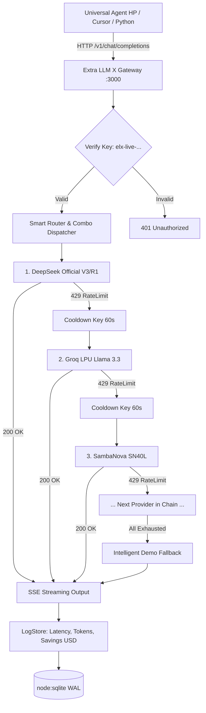

# 🏛️ Extra LLM X — System Architecture & Design Specification

> **Next-Generation 100% Free LLM Gateway, Dynamic Discovery Engine, and API Key Provider Server for Universal Agent HP and Autonomous AI Systems.**

---

## 1. Executive Summary

**Extra LLM X** is a local-first, high-throughput AI gateway engineered to eliminate the financial friction of AI agent execution. While traditional proxies (such as OpenRouter, LiteLLM, or OmniRoute) combine free and commercial paid models, **Extra LLM X is strictly dedicated to 100% FREE AI models and Free-Tier quotas ($0 spend guaranteed)** across all leading AI infrastructure providers.

It serves as an OpenAI-compatible proxy (`/v1/chat/completions`, `/v1/models`) that generates its own authenticated API keys (`elx-live-...`), aggregates models from 16+ providers, automatically monitors health and rate limits, and guarantees zero downtime through intelligent multi-tier fallback chains.

---

## 2. Core Architectural Pillars

```
+-----------------------------------------------------------------------------------+
|               Clients: Universal Agent HP / Cursor / Cline / Python              |
+-----------------------------------------+-----------------------------------------+
                                          | OpenAI API (http://localhost:3000/v1)
                                          v
+-----------------------------------------------------------------------------------+
|                           Extra LLM X Gateway (Express)                          |
|  - Bearer Auth Guard (elx-live-...)                                               |
|  - Rate Limiter & Token Accounting                                                |
|  - Streaming SSE Pipeline (Server-Sent Events)                                    |
+-----------------------------------------+-----------------------------------------+
                                          |
                                          v
+-----------------------------------------------------------------------------------+
|                      Smart Router & Failover Engine (Kahn-Chain)                  |
|  Virtual Combos:                                                                  |
|    * extra/auto-free      * extra/free-coding    * extra/free-fast                   |
|    * extra/free-reasoning * extra/free-vision                                    |
|                                                                                   |
|  Circuit Breaker & Fallback:                                                      |
|    [Primary Key 429] --> [Key Rotation] --> [Next Provider in Chain] --> [Stream]|
+-----------------------------------------+-----------------------------------------+
                                          |
          +-------------------------------+-------------------------------+
          |                               |                               |
          v                               v                               v
+-------------------+           +-------------------+           +-------------------+
| Cloud Providers   |           | Serverless / PAT  |           | Local & Private   |
| - Google Gemini   |           | - GitHub Models   |           | - Ollama (11434)  |
| - Groq LPU        |           | - Hugging Face    |           | - LM Studio (1234)|
| - SambaNova SN40L |           | - Cloudflare AI   |           | - Built-in Mock   |
| - Cerebras CS-3   |           | - DeepInfra       |           |   (Zero-key Demo) |
| - OpenRouter Free |           | - Fireworks AI    |           |                   |
| - Mistral AI      |           | - Together AI     |           |                   |
| - Cohere Trial    |           | - Novita AI       |           |                   |
+-------------------+           +-------------------+           +-------------------+
          |                               |                               |
          +-------------------------------+-------------------------------+
                                          |
                                          v
+-----------------------------------------------------------------------------------+
|                        Embedded State & Storage (SQLite)                          |
|  - Provider Keys & Cooldown Status                                                |
|  - System Client API Keys (elx-live-...)                                          |
|  - Discovered Free Models Catalog & Capabilities                                  |
|  - Telemetry Logs & Cost-Saved ($$$) Calculator                                   |
+-----------------------------------------------------------------------------------+
```

---

## 3. Technology Stack & Runtime Decisions

| Component | Technology Selected | Rationale |
| :--- | :--- | :--- |
| **Runtime** | **Node.js v24 (ES Modules)** | Ultra-fast native HTTP execution, modern ES modules, native fetch API, zero transpilation lag. |
| **Database** | **`node:sqlite` (`DatabaseSync`)** | Node.js v24 built-in synchronous SQLite engine. Zero external C++ native compile requirements on Windows, zero dependency rot. |
| **Server Framework** | **Express.js (v4.21)** | Battle-tested, supports high concurrency, flexible middleware, native SSE streaming pipelines. |
| **Frontend UI** | **Vanilla CSS + Modern ES6 SPA** | Bespoke Cyberpunk Glassmorphic theme. No heavy React/Vite build steps needed, instant boot time, zero bundle size overhead. |
| **Testing** | **`node:test` + `node:assert`** | Built-in zero-dependency testing runner, instant execution. |

---

## 4. Provider Adapter Specification (Plugin Architecture)

Every provider implements the unified `BaseAdapter` interface:
```typescript
interface BaseAdapter {
  id: string;                      // Unique ID (e.g., 'groq', 'gemini')
  name: string;                    // Display name
  badge: string;                   // E.g., '500+ tok/s', '1M+ Context'
  getKeyUrl: string;               // Direct URL to generate free API key
  guide: string;                   // 1-sentence step-by-step instructions
  freeTierInfo: string;            // Limits (e.g., '15 req/min, 1,500 req/day')
  popularModels: string[];         // Key free models
  
  discoverModels(apiKey?: string): Promise<DiscoveredModel[]>;
  executeChat(options: ChatOptions): Promise<Response>;
  classifyError(err: Error, status?: number): ErrorClassification;
}
```

### Supported Providers Matrix (24 Active Providers):
1. **OpenRouter**: Real-time scanner for `:free` and $0 pricing models.
2. **Google AI Studio**: Gemini 2.0 Flash, Gemini 1.5 Flash (15 RPM / 1,500 RPD free forever).
3. **Groq Cloud**: Llama 3.3 70B, DeepSeek R1 Distill, Qwen 2.5 32B (500+ tok/s LPU).
4. **DeepSeek Official**: DeepSeek-V3 & DeepSeek-R1 native chain-of-thought (5M free signup tokens).
5. **Cerebras Cloud**: CS-3 wafer scale inference for Llama 3.3 70B (2,000+ tok/s).
6. **SambaNova Cloud**: SN40L inference for DeepSeek-R1, Llama 3.3 70B.
7. **GitHub Models**: Azure AI endpoint using GitHub Personal Access Token (PAT).
8. **Hyperbolic**: High-performance open-source serverless compute tier.
9. **Mistral AI**: Codestral and Mistral Small developer tiers.
10. **Hugging Face**: Serverless Inference API with free user token.
11. **NVIDIA NIM**: 1,000 free inference credits on high-end GPUs.
12. **SiliconFlow**: Permanent free tier on open-source models (Qwen 2.5, DeepSeek).
13. **Zhipu AI**: GLM-4-Flash 100% Free Forever with 128k context.
14. **AIML API**: Unified multi-model gateway with free developer credits.
15. **Chutes AI**: Decentralized serverless open-source models.
16. **Together AI**: Free developer credit tier adapter.
17. **Cloudflare Workers AI**: Free daily neuron quota adapter.
18. **Fireworks AI**: Developer free tier adapter.
19. **DeepInfra**: Free tier open-source model adapter.
20. **Novita AI**: Trial credit adapter.
21. **Cohere**: Free developer trial API.
22. **Ollama**: Localhost port 11434 auto-discovery.
23. **LM Studio**: Localhost port 1234 auto-discovery.
24. **MockDemoEngine**: Built-in intelligent fallback for offline zero-key testing.

---

## 5. System Architecture & Failover Pipeline (Mermaid)



---

## 6. Resilience & Fallback Engine (Circuit Breakers)

1. **Multi-Key Load Balancing & Rotation**:
   - Users can provide multiple free API keys per provider (e.g. 3 different Groq keys).
   - Extra LLM X round-robins across active keys using least-recently-used scheduling.
2. **Rate Limit (HTTP 429) Quarantine & Header Inspection**:
   - When a 429 response is detected, Extra LLM X parses `Retry-After` or `x-ratelimit-reset` headers to apply the exact cooldown duration dynamically.
   - The dispatcher immediately attempts the next key or provider in the combo chain.
3. **Cross-Provider Failover**:
   - If all keys for a provider are exhausted, the dispatcher cascades to the next provider in the virtual combo chain.
   - Client connections remain intact; streaming responses continue without disconnection.
4. **Automated Health Check Diagnostics**:
   - Background worker probes endpoints periodically and updates provider availability and round-trip latency.

---

## 7. Client API Key Management & Security

- Generated keys follow the format: `elx-live-[32-hex-characters]`.
- Keys are verified directly in SQLite using prepared statements.
- Custom rate limits (Requests Per Minute) per key.
- Provider secrets are masked in the UI (`sk-***1234`) and never exposed in client logs.

---

## 8. Universal Agent HP Integration

- Preconfigured virtual aliases:
  - `extra/auto-free`: Optimal general-purpose model across 24 providers.
  - `extra/free-coding`: High-precision coding chain (Codestral, DeepSeek-V3, Qwen 2.5 Coder).
  - `extra/free-fast`: Sub-second execution loops for DAG waves (Cerebras, Groq, GLM-4).
  - `extra/free-reasoning`: Deep reasoning chain (DeepSeek-R1 native chain-of-thought).
  - `extra/free-vision`: Multimodal image reasoning (Gemini Flash, GPT-4o).
- Native compatibility with `universal --provider omni --model extra/auto-free`.
